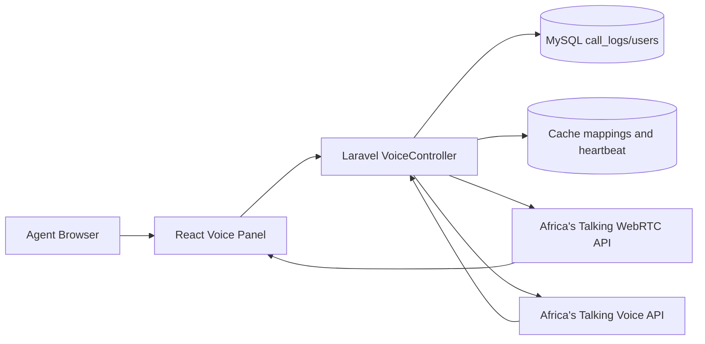
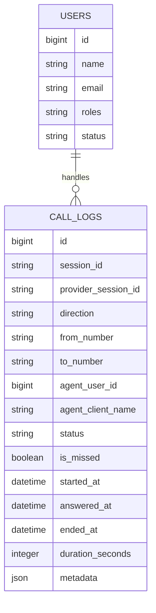
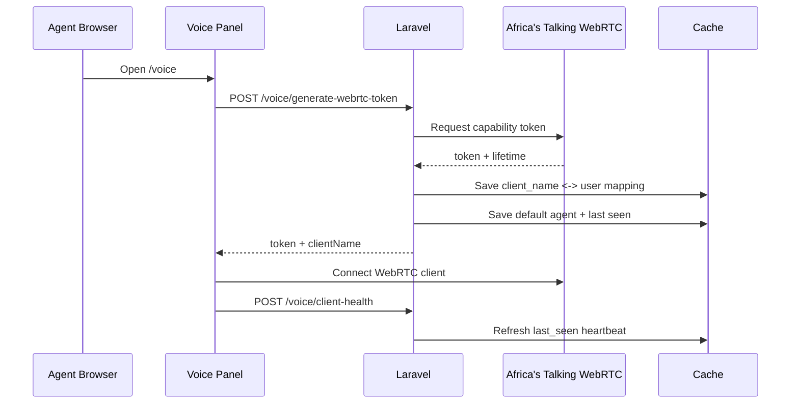
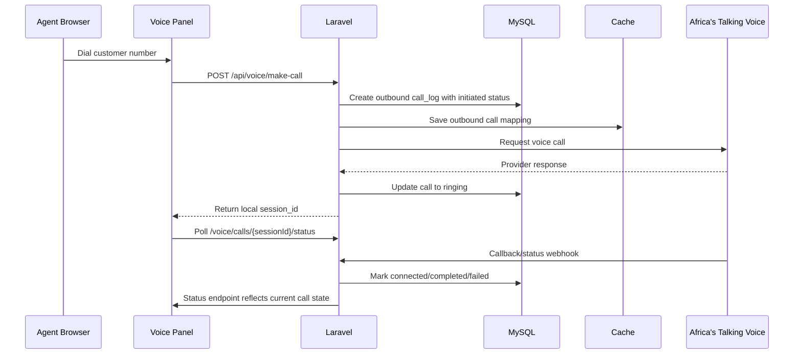
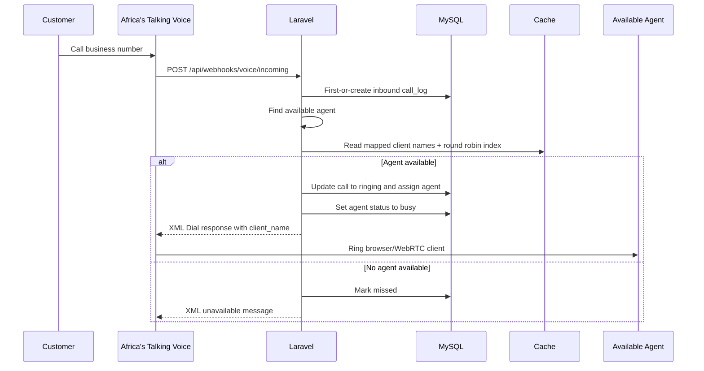
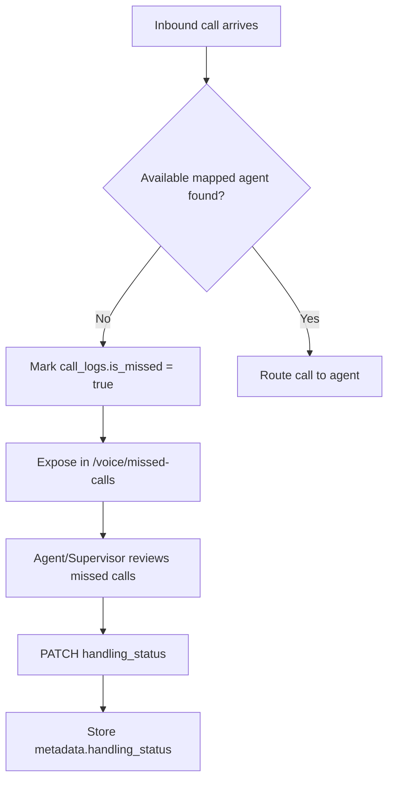
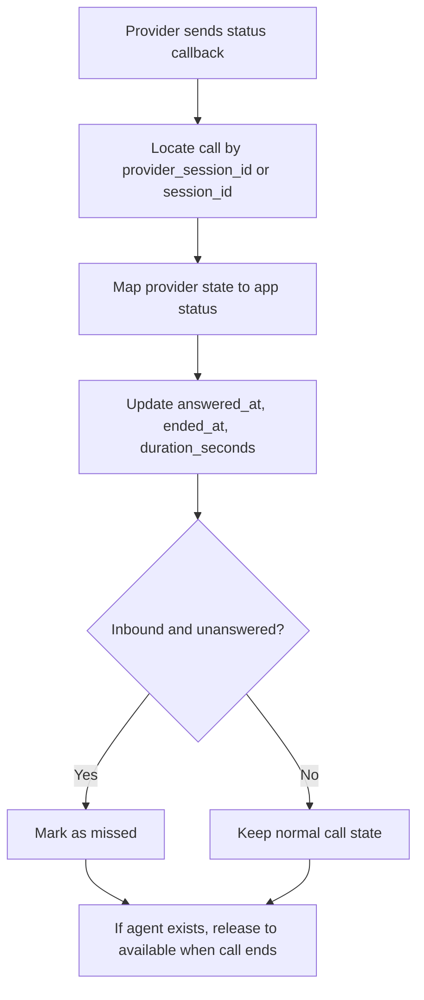

# Cloud-Based Call Center System

A Laravel-based call center platform for browser-based voice operations, agent presence management, inbound call routing, outbound calling, missed-call follow-up, and call activity visibility.

This codebase is centered around Africa's Talking voice/WebRTC flows and a web UI for call center agents. The main runtime behavior lives in [app/Http/Controllers/VoiceController.php](/home/atlas/callcentersys/app/Http/Controllers/VoiceController.php), with the operator UI in [resources/js/components/voice/voice-panel.tsx](/home/atlas/callcentersys/resources/js/components/voice/voice-panel.tsx) and [resources/js/pages/Voice/logs.tsx](/home/atlas/callcentersys/resources/js/pages/Voice/logs.tsx).

## Overview

The system provides:

- browser/WebRTC client initialization for agents
- agent status tracking: `available`, `busy`, `away`, `offline`, `on_call`
- inbound call routing to available mapped agents
- outbound call initiation from the browser
- call lifecycle tracking through provider callbacks
- missed-call listing and handling-state updates
- session visibility for supervisors/operators
- a smoke-check command for recent voice test coverage

## Stack

- Backend: Laravel 12, PHP 8.2+
- Frontend: Inertia.js, React, TypeScript, Vite
- UI: Tailwind CSS, shadcn/ui
- Voice provider: Africa's Talking Voice + WebRTC
- Database: MySQL
- Cache/session support: Laravel cache + session layer

## Main Modules

### 1. Agent Voice Workspace

The voice workspace is the main operator screen at `/voice`.

Responsibilities:

- initialize a WebRTC client for the signed-in agent
- request a capability token from the backend
- map the generated `client_name` to a user
- send heartbeats to keep the agent session fresh
- place outbound calls
- receive inbound calls
- answer, hang up, mute, and monitor call duration
- poll call state for outbound progress updates

Primary files:

- [resources/js/components/voice/voice-panel.tsx](/home/atlas/callcentersys/resources/js/components/voice/voice-panel.tsx)
- [resources/js/pages/Voice/index.tsx](/home/atlas/callcentersys/resources/js/pages/Voice/index.tsx)
- [app/Http/Controllers/VoiceController.php](/home/atlas/callcentersys/app/Http/Controllers/VoiceController.php)

### 2. Call Logs And Session Monitoring

The logs screen at `/voice/logs` gives operators or supervisors a filtered view of call activity and current agent session state.

Capabilities:

- filter logs by direction, status, search term, and page size
- show summary counters for total, active, missed, and completed-today calls
- list agent session state with mapped WebRTC client names and last heartbeat times

Primary files:

- [resources/js/pages/Voice/logs.tsx](/home/atlas/callcentersys/resources/js/pages/Voice/logs.tsx)
- [app/Http/Controllers/VoiceController.php](/home/atlas/callcentersys/app/Http/Controllers/VoiceController.php)

### 3. Missed Call Handling

Missed calls are stored in `call_logs` with `is_missed = true`. The API exposes listing and state updates so the team can mark missed calls as handled or not handled.

Capabilities:

- paginate missed calls
- restrict views for call center agents to their own/unassigned missed calls
- update `metadata.handling_status` to `handled` or `not_handled`

### 4. Voice Smoke Verification

The project includes a CLI verification command to inspect recent voice outcomes after manual testing.

Command:

```bash
php artisan voice:smoke-check
```

Defined in:

- [app/Console/Commands/VoiceSmokeCheck.php](/home/atlas/callcentersys/app/Console/Commands/VoiceSmokeCheck.php)

The command checks recent call logs for scenarios like:

- answered outbound
- busy response
- no answer
- rejected
- inbound traffic observed

## Runtime Architecture



## Core Data Relationships



## End-To-End Processes

### Agent Initialization Flow

When an agent opens the call center screen, the UI initializes the WebRTC client and registers the agent for routing.



Important behavior:

- the agent cannot switch to `available` until a WebRTC client mapping exists
- the backend stores `voice_agent_client_{userId}` and `voice_agent_last_seen_{userId}` in cache
- the frontend sends periodic heartbeat requests while idle and connected

### Outbound Call Flow

Outbound calls are initiated by an agent from the browser. The backend creates a local `call_logs` row first, then the provider callback bridges the customer leg to the WebRTC client.



Detailed backend steps:

1. Normalize the destination number.
2. Create `call_logs` row with `direction = outbound`.
3. Cache outbound session references for callback correlation.
4. Call `https://voice.africastalking.com/call`.
5. Update call status to `ringing` or `failed`.
6. When callback becomes active, bridge to the mapped WebRTC client.
7. When the provider reports an end state, set duration, provider end state, and agent availability.

### Inbound Call Flow

Inbound calls come in through provider webhooks. The backend either routes the caller to an available mapped agent or marks the call as missed.



Routing rules implemented today:

- candidate users are filtered from `users`
- role matching accepts values like `callcenter`, `callcenter1`, `agent`, or strings containing `agent`
- only `status = available` users are considered routable
- agents without a cache-mapped `client_name` are skipped
- available agents are selected with a round-robin index stored in cache

### Missed Call Follow-Up Flow



### Status Synchronization Flow



Provider state mapping in the controller:

- `initiated`, `queued` -> `initiated`
- `ringing` -> `ringing`
- `active`, `answered`, `connected` -> `connected`
- `completed`, `ended` -> `completed`
- `busy`, `rejected`, `notanswered`, `noanswer`, `unavailable` -> `failed`

## Route Map

### Authenticated Web Routes

- `GET /voice` -> main call center workspace
- `GET /voice/logs` -> call logs and agent sessions
- `POST /voice/generate-webrtc-token` -> create WebRTC token
- `POST /voice/client-health` -> update heartbeat
- `PATCH /voice/agent-status` -> change current user availability
- `GET /voice/missed-calls` -> fetch missed calls
- `PATCH /voice/missed-calls/{call}/handling-status` -> update missed-call handling state
- `GET /voice/active-sessions` -> list call center session state
- `POST /voice/set-default-agent` -> store default agent client name
- `GET /voice/test` -> test token request against provider
- `GET /voice/calls/{sessionId}/status` -> query session state

### API Routes / Webhooks

- `POST /api/make-call`
- `POST /api/end-call`
- `POST /api/log-call`
- `POST /api/voice/make-call`
- `POST /api/voice/generate-webrtc-token`
- `POST /api/voice/client-health`
- `POST /api/voice/callback`
- `POST /api/voice/status`
- `POST /api/voice/incoming`
- `POST /api/webhooks/voice/callback`
- `POST /api/webhooks/voice/status`
- `POST /api/webhooks/voice/incoming`

## Status Model

### Agent Statuses

Supported values in the controller:

- `available`
- `busy`
- `away`
- `offline`
- `on_call`

Practical meaning:

- `offline`: not ready for routing
- `away`: intentionally unavailable
- `available`: routable for inbound calls
- `busy`: reserved during inbound assignment/ringing
- `on_call`: currently connected on an active call

### Call Statuses

Common values in `call_logs.status`:

- `initiated`
- `ringing`
- `connected`
- `completed`
- `failed`
- `missed`

## Caching Strategy

The voice flow depends on cache for low-latency presence and routing state.

Current cache keys used by the controller include:

- `voice_client_user_{clientName}`
- `voice_agent_client_{userId}`
- `voice_agent_last_seen_{userId}`
- `default_agent`
- `voice_rr_index`
- `outbound_call_{localSessionId}`
- `active_outbound_{phoneNumber}`

Cache is important for:

- linking a signed-in user to a WebRTC `client_name`
- showing session presence in the UI
- routing inbound calls only to browser clients that are actually initialized
- correlating outbound provider callbacks to local call sessions

## Database Notes

The runtime depends primarily on:

- `users`
- `call_logs`

Important note:

- this repository currently does not include a full clean-slate schema for the wider application database
- it contains voice-related incremental migrations, not a full from-zero migration history
- for a real environment, use the intended project schema/database backup before relying on `php artisan migrate` alone

Voice-related migrations present in the repo:

- `2026_02_11_150000_add_status_to_users_table`
- `2026_02_11_150100_create_call_logs_table`
- `2026_02_14_073000_fix_call_logs_id_auto_increment`

## Configuration

Key `.env` values for the voice system:

```env
APP_NAME="Cloud-Based Call Center System"
APP_URL=http://127.0.0.1:8000

DB_CONNECTION=mysql
DB_HOST=127.0.0.1
DB_PORT=3306
DB_DATABASE=realdeal
DB_USERNAME=maikol
DB_PASSWORD=your-password

AFRICASTALKING_USERNAME=your-username
AFRICASTALKING_API_KEY=your-api-key
AFRICASTALKING_CALL_FROM=+254700000000
```

Voice-specific configuration sources:

- `config/services.php`
- [app/Http/Controllers/VoiceController.php](/home/atlas/callcentersys/app/Http/Controllers/VoiceController.php)

## Local Setup

### 1. Install Dependencies

```bash
composer install --no-dev
npm install
```

If you need the full dev toolchain:

```bash
composer install
```

### 2. Create Environment File

```bash
cp .env.example .env
php artisan key:generate
```

If `.env.example` is not present, create `.env` manually using the config above.

### 3. Point The App To A Real Schema

Because the repository does not contain the full historical schema, make sure your MySQL database already contains the main application tables, especially:

- `users`
- `call_logs`

### 4. Build Frontend Assets

```bash
npm run build
```

For local frontend development:

```bash
npm run dev
```

### 5. Start The App

```bash
php artisan serve
```

Open:

- `http://127.0.0.1:8000/voice`
- `http://127.0.0.1:8000/voice/logs`

## Testing And Verification

### Manual Voice Smoke Check

Run after manual provider testing:

```bash
php artisan voice:smoke-check
```

Custom window/scenarios:

```bash
php artisan voice:smoke-check --hours=4 --require=answered,busy,noanswer,rejected,inbound
```

### Recommended Manual Test Matrix

1. Initialize an agent and confirm token generation succeeds.
2. Set the agent to `available`.
3. Place an outbound call and verify:
   - local call row is created
   - call moves through `initiated` -> `ringing` -> `connected/completed`
4. Trigger an inbound call and verify:
   - round-robin routing selects an available mapped agent
   - agent status changes to `busy`/`on_call`
5. Trigger an inbound call with no available agents and verify:
   - call is marked `missed`
   - missed-call endpoint returns the row
6. Mark a missed call as `handled`.
7. Run `php artisan voice:smoke-check`.

## Operational Caveats

- agent routing depends on both `users.status = available` and a cache-mapped `client_name`
- outbound state tracking relies on provider callbacks and cache correlation
- the frontend uses polling for outbound session status
- some callback responses intentionally return XML as `text/plain` because that is what the provider expects
- `AFRICASTALKING_CALL_FROM` falls back to `+254709369980` if not configured
- `AFRICASTALKING_USERNAME` falls back to `rdlcallcenter` if not configured

## File Guide

Core backend files:

- [app/Http/Controllers/VoiceController.php](/home/atlas/callcentersys/app/Http/Controllers/VoiceController.php)
- [app/Models/CallLog.php](/home/atlas/callcentersys/app/Models/CallLog.php)
- [app/Models/User.php](/home/atlas/callcentersys/app/Models/User.php)
- [app/Console/Commands/VoiceSmokeCheck.php](/home/atlas/callcentersys/app/Console/Commands/VoiceSmokeCheck.php)
- [routes/web.php](/home/atlas/callcentersys/routes/web.php)
- [routes/api.php](/home/atlas/callcentersys/routes/api.php)

Core frontend files:

- [resources/js/components/voice/voice-panel.tsx](/home/atlas/callcentersys/resources/js/components/voice/voice-panel.tsx)
- [resources/js/pages/Voice/index.tsx](/home/atlas/callcentersys/resources/js/pages/Voice/index.tsx)
- [resources/js/pages/Voice/logs.tsx](/home/atlas/callcentersys/resources/js/pages/Voice/logs.tsx)

## License

This project is currently documented as an internal application. Add the licensing terms you want to enforce before distributing it externally.
